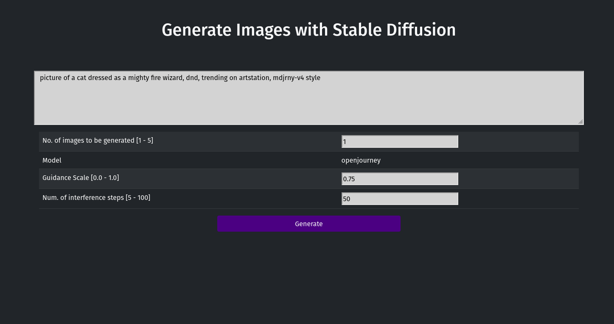

# Diffusional - A Stable Diffusion / Diffusional image generation toy

This is a small toy project that I threw together while playing around with Stable Diffusion (using the phenomenally good [HuggingFace Diffusers](https://huggingface.co/docs/diffusers/v0.3.0/en/api/pipelines/stable_diffusion) project / model / pipeline!).

It provides a web UI where you can enter a prompt, tweak some parameters and then generate images from those inputs.

Models used for the image generation are defined in `config.py`.

**Disclaimer** This project is not affiliated with HuggingFace or Stable Diffusion in any way (and neither am I btw).

### Requirements

* Python3.10+
* [poetry](https://python-poetry.org/)
* (probably) recent (2022 and newer) Nvidia graphics card
* at least 8GB RAM (the more the better)

### Usage

1. Make sure you meet the hardware requirements!
2. In the project folder, run `poetry install` to fetch all dependencies.
3. Check `config.py` and make sure to fill in at least `model_id` or `model_path`. If you're unsure about what model to use, I've mostly used [Stable Diffusion v2.1](https://huggingface.co/stabilityai/stable-diffusion-2-1) during development / testing.
4. Run `poetry run flask --app diffusional/main run`
5. Open `http://localhost:5000/` in your preferred browser.
6. Have fun generating images :)

**Screenshot: WebUI**

#### Saving images

After you've generated some images, a "Save" option appears above your image list. As you might've guessed, this allows you to "save" images that you've generated and like: fill in the field `prefix` and hit "Save". Your images will then be move into a folder called whatever you just typed into `prefix` together with a file `prompt.txt` where you'll find the prompt that was used to generate those images. 

## TODOs

* [x] Create a web UI for basic image generation via prompt
* [x] tweak image generation using `guidance scale` and `number_inference_steps`
* [x] make models used for image generation configurable (via `config.py`)
* [ ] introduce image2image generation
